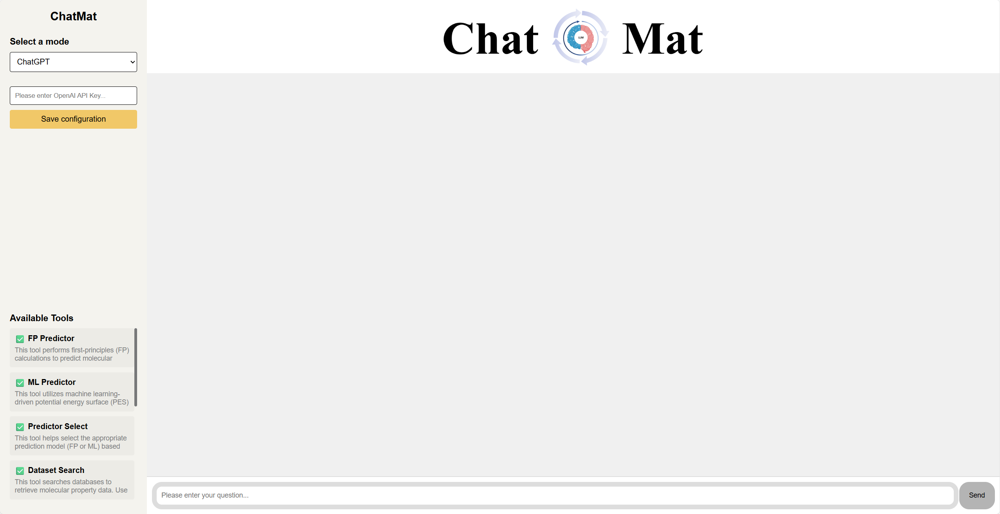

# ChatMat: A Multi-Agent Chemist for Autonomous Material Prediction and Exploration

ChatMat is an autonomous AI chemist powered by large language models (LLMs) and a modular multi-agent system. It is designed to perform complex material property predictions and exploratory tasks with minimal human intervention. 
Leveraging LLMs such as GPT-4o or local foundation models, ChatMat can:

Interpret unstructured natural language prompts

Plan scientific procedures

Execute end-to-end workflows in computational materials science

The system includes a Manager agent that orchestrates four role-specific agents:

🧪 Property Searcher – Retrieves material data from databases

🧮 Computing Designer – Designs appropriate simulation pipelines

⚛️ FP Operator – Performs high-accuracy first-principles (DFT) calculations

🤖 ML-PES Performer – Constructs machine learning-based potential energy models

Together, these agents enable ChatMat to bridge data-driven and physics-based methods into a unified, autonomous pipeline.

🚀 Key Features
Minimal human input required

Natural language interface for scientific workflows

Fully autonomous agent collaboration

Adaptable to multiple material systems and domains

📊 Evaluation
ChatMat has been quantitatively benchmarked across multiple complex tasks, showing high reliability, accuracy, and adaptability. It represents a step forward in the development of domain-specific autonomous research systems for computational materials discovery.


## Install dependencies

```
pip install -r requeirements.txt
```

## How to use ChatMat

Add the following line to `.bashrc` for the openai api key. 

```
# openai api key
export OPENAI_API_KEY="enter_your_api_key"
```

You can use it by running ChatMat's `main` function.

```
python main.py
```

Run ChatMat on the web.

```
python -m frontend.app
```

